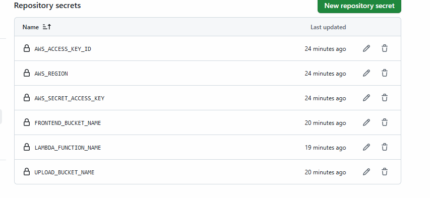
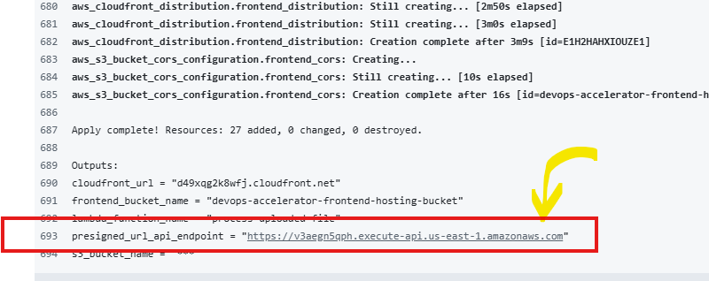
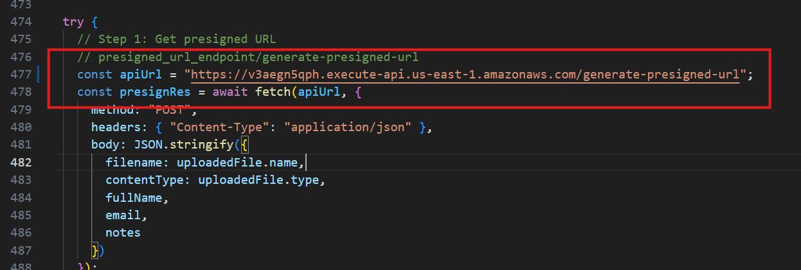
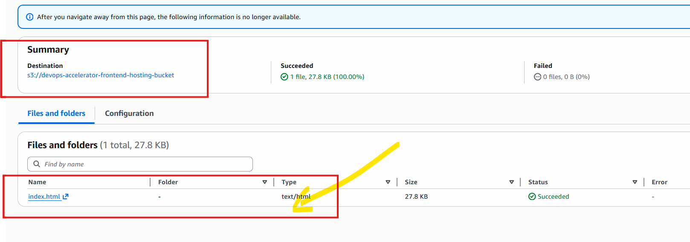
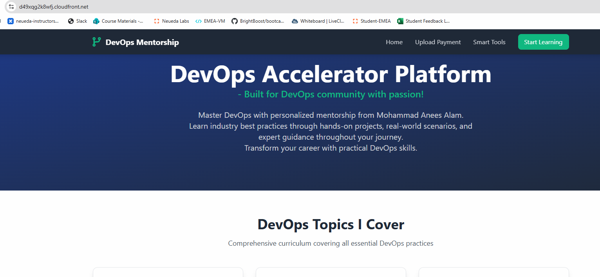
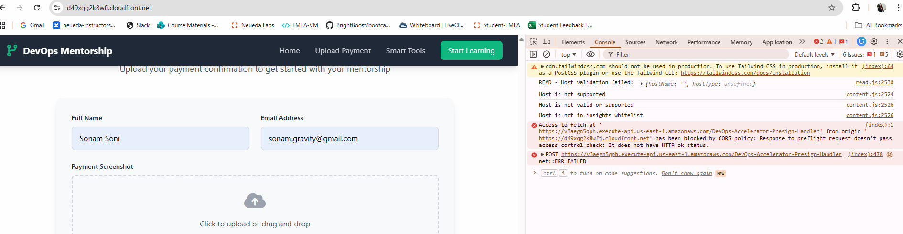
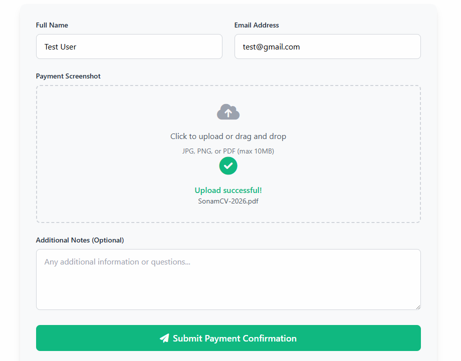

# Project Implementation Steps

- create folder named frontend:
    + create file named index.html 
    + add the code shown here
- create folder named Backend
    + create folder generate-presigned-url
        - create main.py
    + create folder process-uploaded-file
        - create main.py

## Setting Up Infra

- folder named infra
    + folder named terraform
        - main.tf
        - variables.tf
        - outputs.tf
        - terraform.tfvars

## Bucket Info

- here, we are using 3 buckets
    1. S3 Remote Backend
    2. for uploading files
    3. for frontend hosting (index.html) - for cloud front

## Roles

- in terraform created one role: lambda-exec-role
- attached 2 policies
    + AWSLambdaBasicExecutionRole
    + AmazonS3FullAccess

**When you implement change bucket name as per your requirement**

1. Create Zip files for Lambda

```bash
cd backend/generate-presigned-url
zip -r lambda.zip .

cd backend/process-uploaded-file
zip -r lambda.zip .
```

2. Create Bucket For Remote Backend

```bash
aws s3api create-bucket \
--bucket devops-accelerator-platform-tf-state-sonam \
--region us-east-1
```

3. DynamoDB Table for Locking

```bash
aws dynamodb create-table \
--table-name devops-accelerator-tf-locker \
--attribute-definitions AttributeName=LockID,AttributeType=S \
--key-schema AttributeName=LockID,KeyType=HASH \
--billing-mode PAY_PER_REQUEST \
--region us-east-1
```
4. Create Pipeline for Frontend and Backend Code Deploy

- backend.yml
- frontend.yml

### Repository Secrets

- AWS_ACCESS_KEY_ID: Your ACCESS KEY
- AWS_SECRET_ACCESS_KEY: YOUR SECRET ACCESS KEY
- AWS_REGION: us-east-1
- LAMBDA_FUNCTION_NAME: process-uploaded-file
- FRONTEND_BUCKET_NAME: devops-accelerator-frontend-hosting-bucket
- UPLOAD_BUCKET_NAME: devops-accelerator-upload-bucket

4. Create pipeline for executing Terraform Code

- terraform.yml

- set Repository Secrets: repo-> settings --> actions -> repo secrest



- once pipeline executes copy the presigned URL and update index.html code as shown here





- once HTML code updated then upload it to your frontend Bucket



- Copy Cloud Front URL and access it in browser



- try to submit the form and you can see cors error



[Policy Reference](https://docs.aws.amazon.com/AmazonS3/latest/userguide/ManageCorsUsing.html)

- bucket (upload bucket) --> Permissions -> CORS policy - add below code

```json
[
    {
        "AllowedHeaders": [
            "*"
        ],
        "AllowedMethods": [
            "GET",
            "PUT",
            "POST",
            "DELETE",
            "HEAD"
        ],
        "AllowedOrigins": [
            "*"
        ],
        "ExposeHeaders": []
    }
]
```

**If still you are gettin getting Error**

- AWS Console --> APIs -
    - select API for DevOps-Accelerator-Presign-API
    - Left Panel --> Protect --> Throtlling
    - Edit Default Stage:
        - Burst limit: 100
        - Rate Limit: 200
        - Save

- check your email as well and confirm subscription

 ## you can see upload

 

 - Also, check email once upload doe successfull
 - check Cloud Watch for Logs
 - Check S3 bucket to see the uploads
